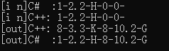
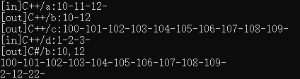
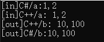
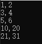
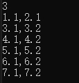

本项目用于测试C#调用C++ DLL时，其数据互送规则

## 数据封送类型

**1. 基础数据类型**


- 对于P/Invoke(平台调用)，具有相同格式的托管和c++本机基元类型之间不需要封送处理。例如，在Int32和int之间，或者在Double和double之间不需要封送处理
- 但是必须对不具有相同形式的类型进行封送处理。 这包括 char、string 和 struct 类型， 在 C/C++中long和int都是4个字节，都对应着 C#中的int 类型，而C/C++中的char类型占一个字节，用来表示一个ASCII码字符，在 C#中能够表示一个字节的是byte类型
- 没使用out修饰符的是C#->C++，使用的是C++->C#

```C++
void func1(int a, double b, char c,int& d, double& e, char& f) {
    std::cout << "[i n]C++: " << a << "-" << b << "-" << c << "-" << d << "-" << e << "-" << f << endl;
    a = 8, b = 3.3, c = 'K';
    d = 8, e = 10.2, f = 'G';
    std::cout << "[out]C++: " << a << "-" << b << "-" << c << "-" << d << "-" << e << "-" << f << endl;
};
```


```c#
[DllImport("CPPDLL.dll", EntryPoint = "func1", SetLastError = true, CharSet = CharSet.Ansi)]
public static extern unsafe void func1(int a, double b, char c, out int d,out double e, out char f);

public static void test_func1()
{
    int a = 1; double b = 2.2;char c = 'H';
    int d=0; double e=0; char f=' ';
    Console.WriteLine("[i n]C#  :"+a + "-" + b + "-" + c + "-" + d + "-" + e + "-" + f);
    func1(a, b, c, out d, out e, out f);
    Console.WriteLine("[out]C#  :" + a + "-" + b + "-" + c + "-" + d + "-" + e + "-" + f);
}
```





**2. 数组/指针**

- C++定义为指针，C#使用fxied将数组转为指针封送
- 如果C#需要拿到C++的不定长的数组返回，需要使用Marshal解析封装
- C#可使用指针向C++发送数据，也可直接发送数组

```C++
void func2(int* a, int aNum,int* b,int*& c, int& cNum, int* d, int dNum) {
    // 打印C#传递过来的数组
    std::cout << "[in]C++/a:";
    for (int i = 0; i < aNum; i++)
    {
        std::cout << a[i] << "-";
    }
    std::cout << "" << endl;

    b[0] = 10;
    b[1] = 12;
    std::cout << "[out]C++/b:" << b[0]  << "-" << b[1] << endl;

    cNum = 10;
    c = new int[cNum];
    std::cout << "[out]C++/c:";
    for (int i = 0; i < cNum; i++)
    {
        c[i] = 100 + i;
        std::cout << c[i] << "-";
    }
    std::cout << "" << endl;

    std::cout << "[in]C++/d:";
    for (int i = 0; i < dNum; i++) {
        std::cout << d[i] << "-";
        d[i] = i * 10 + 2;
    }
    std::cout << "" << endl;
};
```


```C#
[DllImport("CPPDLL.dll", EntryPoint = "func2", SetLastError = true, CharSet = CharSet.Ansi)]
public static extern unsafe void func2(int* a, int aNum,int* b,out IntPtr c, out int cNum,int[] d,int dNum);

public static void test_func2()
{
    int aNum = 3;
    int[] a=new int[aNum];
    for(int i=0;i<aNum;i++)
    {
        a[i] = i + 10;
    }

    int[] b = new int[2];
    int dNum = 3;
    int[] d = { 1, 2, 3 };

    int cNum = 0;
    unsafe
    {
        fixed (int* a_ptr = a)
        {
            fixed (int* b_ptr = b)
            {
                IntPtr c;
                func2(a_ptr, aNum, b_ptr, out c, out cNum,d,dNum);

                Console.WriteLine("[out]C#/b:" + b[0]+","+b[1]);

                int[] arr = new int[cNum];
                Marshal.Copy(c, arr, 0, cNum);
                for (int i = 0; i < cNum; i++)
                {
                    Console.Write(arr[i] + "-");
                }

                Console.WriteLine("");
                for (int i = 0; i < dNum; i++)
                {
                    Console.Write(d[i] + "-");
                }
            }

        }
    }
}
```



解释：

1. 数组a：C#向C++传递数组，并使用aNum确定数量
2. 数组b：C#申请空间，C++按约定空间赋值，然后C#打印
3. 数组c：C#向C++传递IntPtr指针，C++动态返回不定长的数据，然后C#使用Marshal解析数据
4. 数组d：类似数组b，C#声明不一样，使得不用使用fixed

**3. 数据结构**

- C#和C++定义相同的数据结构，然后将数据结构当作基础数据类型使用
- 需要接收C++返回时，使用out修饰符

```C++
void func3(point a, point& b) {
    std::cout << "[in]C++/a: " << a.x << "," << a.y << endl;

    b.x = 10;
    b.y = 100;
    std::cout << "[out]C++/b: " << b.x << "," << b.y << endl;
}
```


```C#
[DllImport("CPPDLL.dll", EntryPoint = "func3", SetLastError = true, CharSet = CharSet.Ansi)]
public static extern unsafe void func3(point a,out point b);

public static void test_func3()
{
    point a=new point(1,2);
    Console.WriteLine("[in]C#/a:" + a.x + "," + a.y);

    point b;
    func3(a, out b);
    Console.WriteLine("[out]C#/b:" + b.x + "," + b.y);
}
```



解释：

1. 结构a：C#向C++传递结构数据
2. 结构b：C++声明结构变量，C++赋值，C#可以拿到其值

**4. 结构数组(单层指针)**

- 结构数组和基础数据类型的数组传递方法类似

```C++
void func4(point* a, int aNum, point* b, int bNum) {

    for (int i = 0; i < aNum; i++)
    {
        std::cout << a[i].x << "," << a[i].y << endl;
    }

    for (int i = 0; i < bNum; i++)
    {
        b[i].x = (i+1)*10+i;
        b[i].y = (i + 2) * 10 + i;
    }
}
```


```C#
[DllImport("CPPDLL.dll", EntryPoint = "func4", SetLastError = true, CharSet = CharSet.Ansi)]
public static extern unsafe void func4(point* a, int aNum,point* b,int bNum);

public static void test_func4()
{
    point[] a =
    {
        new point(1,2),
        new point(3,4),
        new point(5,6)
    };
    int aNum = a.Length;

    int bNum = 2;
    point[] b = new point[bNum];

    unsafe
    {
        fixed(point* a_ptr=a)
        {
            fixed (point* b_ptr = b)
            {
                func4(a_ptr, aNum, b_ptr, bNum);

                for (int i = 0; i < bNum; i++)
                {
                    Console.WriteLine(b[i].x + "," + b[i].y);
                }
            }
        }
    }
}

```



解释：

1. 结构指针a：既可向C++传递数据，也可向C#传递数据
2. 结构指针b：既可向C++传递数据，也可向C#传递数据


**5.结构数组(嵌套指针)**

- 多重指针，最外层需要在C#指定空间，或者使用IntPtr传递

```C++
void func6(point** ployPoints, int ployNum, int* ployPointsNum)
{
    ployPoints[0] = new point[1];
    ployPoints[0][0].x = 1.1;
    ployPoints[0][0].y = 2.1;

    ployPoints[1] = new point[2];
    ployPoints[1][0].x = 3.1;
    ployPoints[1][0].y = 3.2;
    ployPoints[1][1].x = 4.1;
    ployPoints[1][1].y = 4.2;

    ployPoints[2] = new point[3];
    ployPoints[2][0].x = 5.1;
    ployPoints[2][0].y = 5.2;
    ployPoints[2][1].x = 6.1;
    ployPoints[2][1].y = 6.2;
    ployPoints[2][2].x = 7.1;
    ployPoints[2][2].y = 7.2;

    ployNum = 3;
    ployPointsNum[0] = 1;
    ployPointsNum[1] = 2;
    ployPointsNum[2] = 3;
}
```

```C#
[DllImport("CPPDLL.dll", EntryPoint = "func6", SetLastError = true, CharSet = CharSet.Ansi)]
public static extern unsafe void func6(point** ployPoints, int ployNum, int[] ployPointsNum);

// C#申请第一层空间，C++申请第二层空间
public static void Test_func6()
{
    unsafe
    {
        int ployNum = 3;
        point*[] ployPointsList = new point*[ployNum];
        int[] ployPointsNum = new int[ployNum];
        fixed (point** ployPoints = ployPointsList)
        {
            func6(ployPoints, ployNum, ployPointsNum);
            Console.WriteLine(ployNum);
            for (int i = 0; i < ployNum; i++)
            {
                for (int j = 0; j < ployPointsNum[i]; j++)
                {
                    Console.WriteLine(ployPointsList[i][j].x + "," + ployPointsList[i][j].y);
                }
            }
        }
    }
}
```



解释

1. 结构指针ployPoints：双重指针，先在C#申请第一重空间，然后在C++申请第二重空间，并返回每个二重空间的大小
2. 指针指向空间长度指针ployPointsNum：第二层空间的大小，是一个列表

**5. 类**

- 类封送不能使用P/Invoke的方式，需要编写CLR工程封送，也就是“非托管类(C++) <-> 托管类(CLR) <->C#”，详细看CLR如何将C++的类MyClass以接口的形式封装为托管类ManegerClass


# 技巧

1. 确定封送方向：是C#->C++，还是C++->C#
2. 确定数据空间申请位置：如果是确定的空间，可直接在C#的申请，如果是动态的，需要使用Marshal解析数据

